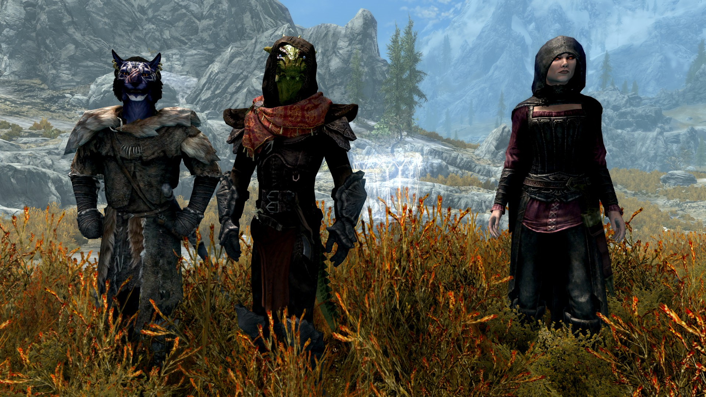

  
    <picture>
    
    </picture>

    
This mod for Skyrim Special Edition introduces three lesser powers to make traveling with followers more comfortable. They are added to you automatically. Each lesser power opens a menu upon casting.

### Lesser Power 1: Bond of Friendship (the Actor Manager)
Used for managing features and actors (i.e. followers and all types of commanded actors such as summons or reanimated minions).

- **Automatic Calm:** A passive ability that automatically stops any hostility due to friendly fire towards other actors who possess this ability, as well as the player. All of your follower's summons automatically receive the ability (*requires Papyrus Extender*).
- **Friendly Hits:** This option toggles whether the actor ignores friendly fire or reacts to it.
- **Knockout Prevention:** Grants a passive ability that automatically triggers when the actor's health drops below 40% to protect them from being knocked out.
- **Edit Stats:** Customize the actor's attributes, including health, stamina, magicka, combat/magic/stealth skills, and resistances. (Only available in the single-actor version of this power. *Requires UIExtensions*.)
- **Mortality:** Change whether the actor is essential (immortal) or can be killed in combat.
- **Quick Menu:** Replaces the actor's default activation with the "Bond of Friendship - Requests" menu. While active, normal dialogue options are suppressed, but you can still access them via the custom "Talk" command. 
- **Teammate:** Toggles the actor's teammate status, ensuring they draw their weapon and sneak in sync with the player.
- **Auto Equip:** Forces the actor to automatically equip items (weapons, armor, etc.) placed into their inventory via the "Bond of Friendship - Requests -> Inventory" menu. Should be disabled if you use external outfit managers.
- **Auto Teleport:** Automatically teleports the actor to your position if they have fallen too far behind.
- **Scan Followers:** Scans and assigns your entire follower group to the Actor Manager, eliminating the need to target each one manually. A massive time-saver for large parties. (*Requires Papyrus Extender*.)
- **Actor List:** Opens a menu displaying all currently managed actors.

#### Context-Sensitive Casting Mechanics
How the power behaves depends entirely on your weapon state when cast:

- **Weapon Drawn (Pointing at a target):** Assigns the targeted NPC to the *Bond of Friendship* Actor Manager and immediately opens the single-actor menu to customize their features.
- **Weapon Sheathed:** Opens the multiple-actor version of the menu to manage features and options for all assigned actors at once.

### Lesser Power 2: Bond of Friendship - Debug Utility

A powerful troubleshooting tool designed to fix common Skyrim follower bugs, such as broken AI, stuck animations, or lost NPCs. 

#### Available Debug Actions
- **Disable/Enable:** Safely toggles the actor's existence to fix invisibility or visual glitches.
- **Get Up!:** Instantly forces the actor out of the stuck crawling/bleeding-out animation on the ground.
- **Reset AI:** Restarts the actor's artificial intelligence package if they stop responding. *(Requires ConsoleUtilSSE)*
- **Recycle Actor:** Completely resets the actor to their default spawning state. *(Requires ConsoleUtilSSE)*
- **Reset Inventory:** Restores the actor's default outfit and starting items. *(Requires SKSE)*
- **Move To Me:** Teleports the selected actor directly to your current position.

#### Context-Sensitive Casting Mechanics
The scope of the Debug Utility depends on your weapon state when cast:

- **Weapon Drawn:** Directly targets the NPC you are pointing at (the actor does not need to be assigned to the Actor Manager).
- **Weapon Sheathed:** Opens a slot-based navigation menu (`First Slot`, `Next Slot`, `Previous Slot`, `Last Slot`) allowing you to select any assigned actor from a distance. Once selected, choose `> Actions` to execute any of the debug options above. This is highly useful for locating lost companions via *Move To Me* or fixing vanished NPCs via *Disable/Enable*.

### Lesser Power 3: Bond of Friendship - Requests
Provides a quick-access menu to issue core commands directly to your followers, avoiding tedious dialogue menus.

#### Context-Sensitive Casting Mechanics
The available requests and their scope depend entirely on your weapon state when cast:

- **Weapon Drawn (Targeted Actor):** Opens the single-target requests menu with the following options:
  - **Talk:** Initiates normal dialogue with the NPC (essential if the *Quick Menu* feature is active).
  - **Wait / Follow:** Toggles whether the individual actor stands ground or stays with you.
  - **Favor:** Commands the actor to perform a specific action in the environment (e.g., lockpicking, stealing, or sitting).
  - **Inventory:** Opens the actor's inventory container directly to trade gear.

- **Weapon Sheathed (All Assigned Followers):** Opens the global team menu to issue commands to your entire party simultaneously:
  - **Wait / Follow:** Orders all managed followers to wait or follow at once.
  - **Meeting Point:** Allows you to set or remove a custom meeting point anywhere in Skyrim. You can teleport yourself and/or your followers directly to this point. Includes an emergency teleport to Dragonsreach for both the player and followers.

#### Available Commands for Commanded Actors
- Follow, Wait, Inventory

## Media
*(Windows/Linux: Ctrl + Click to open image in a new tab | macOS: Cmd + Click)*

Followers
 
     
  

  
📸 View Menu Screenshots (Click to expand)
 
     

Actor Manager
     
     
    
    
  

Debug Utility and Debug Actions
     
     
    
    
  
  
    

